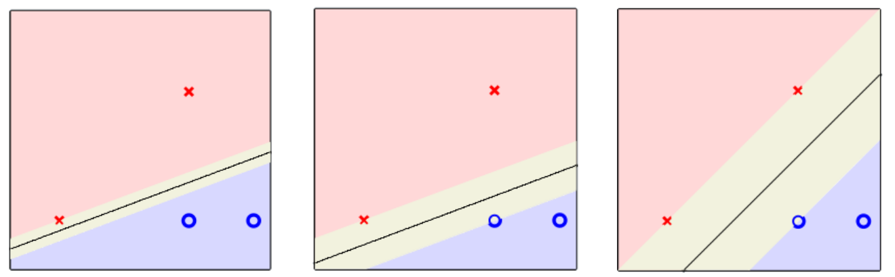
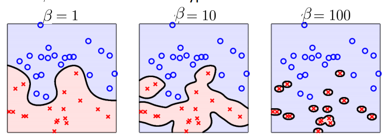

# Machine Learning Übersicht

## Inhaltsverzeichnis

- [Machine Learning Übersicht](#machine-learning-übersicht)
  - [Inhaltsverzeichnis](#inhaltsverzeichnis)
  - [1. Lernarten](#1-lernarten)
    - [1.1 Überwachtes Lernen](#11-überwachtes-lernen)
    - [1.2 Unüberwachtes Lernen](#12-unüberwachtes-lernen)
  - [2. Algorithmen](#2-algorithmen)
  - [3. Transformationen](#3-transformationen)
  - [4. Modellqualität](#4-modellqualität)
  - [5. Validierung](#5-validierung)
  - [6. Statistische Prinzipien](#6-statistische-prinzipien)
  - [Klassifikation](#klassifikation)
  - [Regression](#regression)
  - [Basics Pythonlibs](#basics-pythonlibs)
    - [Explorative Datenanlyse](#explorative-datenanlyse)
      - [Schneller Überblick über die Daten](#schneller-überblick-über-die-daten)
      - [Histogram](#histogram)
    - [Matplotlib](#matplotlib)
      - [Funktion Ploten](#funktion-ploten)
      - [Daten generieren](#daten-generieren)
  - [Daten Skalieren](#daten-skalieren)
    - [`StandardScaler`](#standardscaler)
    - [`MinMaxScaler`](#minmaxscaler)
    - [Wann was?](#wann-was)
  - [Der Perzepton](#der-perzepton)
  - [PLA _Perzeption Lern-Algoritmus_](#pla-perzeption-lern-algoritmus)
  - [Pocket - PLA Erweiterung](#pocket---pla-erweiterung)
  - [Lineare/Polynomielle Regression](#linearepolynomielle-regression)
  - [Nicht-Lineare Transformation](#nicht-lineare-transformation)
  - [Lineare/Polynomielle Regression mit **Weight Decay** und Transformation](#linearepolynomielle-regression-mit-weight-decay-und-transformation)
  - [$E\_{OUT}$ bestimmten _mit Target-Function_](#e_out-bestimmten-mit-target-function)
  - [$E\_{IN}$ bestimmten](#e_in-bestimmten)
  - [Validierung](#validierung)
    - [Hold-Out-Validierung](#hold-out-validierung)
      - [Gittersuche](#gittersuche)
      - [Fehler Schätzen](#fehler-schätzen)
    - [Leave-One-Out-Validierung](#leave-one-out-validierung)
    - [V-fache Kreuzvalidierung](#v-fache-kreuzvalidierung)
    - [`GridSearchCV`](#gridsearchcv)
  - [Logistische Regression](#logistische-regression)
  - [Information Gain](#information-gain)
    - [Entropie $H(X)$](#entropie-hx)
    - [Bedingte Entropie $H(X|Y)$](#bedingte-entropie-hxy)
    - [Information Gain $IG(X|Y)$](#information-gain-igxy)
    - [Regressionsbäume aufbauen](#regressionsbäume-aufbauen)
  - [KNN Nearest Neighboour Model](#knn-nearest-neighboour-model)
  - [SVMs Support Vector Machine](#svms-support-vector-machine)
      - [Ausgangspunkt lineare Klassifikation](#ausgangspunkt-lineare-klassifikation)
    - [Rand (Margin)](#rand-margin)
  - [Hard-Margin SVM](#hard-margin-svm)
  - [Soft-Margin SVM](#soft-margin-svm)
    - [Hinge Loss](#hinge-loss)
  - [Kernel-Trick](#kernel-trick)
    - [linear Kernel](#linear-kernel)
    - [Polynimialer Kernel](#polynimialer-kernel)
    - [Gaußer RBF-Kernel (sehr wichtig)](#gaußer-rbf-kernel-sehr-wichtig)
    - [Zusammenspiel aller Entscheidungen](#zusammenspiel-aller-entscheidungen)
  - [LS‑SVM – Einordnung](#lssvm--einordnung)
  - [Dimensionsreduktion Begründung](#dimensionsreduktion-begründung)
    - [*Curse of Dimensionality*](#curse-of-dimensionality)
  - [PCA](#pca)
    - [Kernel-PCA](#kernel-pca)

---

## 1. Lernarten

### 1.1 Überwachtes Lernen
- **Klassifikation**  
  - Lineare Modelle: [Perzeptron](#2-algorithmen), [Logistische Regression](#2-algorithmen), [Lineare SVM](#2-algorithmen), [ÖDA (LDA)](#2-algorithmen)  
  - Nichtlineare Modelle: [Kernel-SVM](#2-algorithmen), [kNN](#2-algorithmen)
- **Regression**  
  - Linear: Lineare Regression, Ridge, Lasso  
  - Nichtlinear: Polynomiale Regression, kNN-Regression, SVR (Kernel)

### 1.2 Unüberwachtes Lernen
- **Clustering**: K-Means  
- **Dimensionsreduktion**: PCA, Kernel-PCA, ÖDA

---

## 2. Algorithmen
- **Perzeptron / Pocket**: Lineare Klassifikation, speichert beste Lösung bei nicht separierbaren Daten  
- **Logistische Regression**: Lineares probabilistisches Modell für Klassifikation  
- **SVM / Kernel-SVM**: Maximale Margin Klassifikation, Kernel für nichtlineare Trennung  
- **kNN / kNN-Regression**: Instanzbasiert, Klassifikation/Regression über Nachbarn  

---

## 3. Transformationen
- **Lineare Transformation**: Drehen, Strecken, Projektion (z. B. PCA, LDA)  
- **Nichtlineare Transformation**: Polynomfeatures, Kernel-Abbildung, Aktivierungsfunktionen  
- **Skalierung der Daten**: Standardisierung, Min-Max, Robust, Log; wichtig für kNN, SVM, PCA, Regression  

---

## 4. Modellqualität
- **Approximation**: Anpassung an Trainingsdaten  
- **Generalisierung**: Performance auf neuen Daten  
- **Overfitting**: Zu starkes Anpassen, schlechte Generalisierung  
- **Regularisierung**: L1/L2-Strafterm, Margin, reduziert Overfitting  

---

## 5. Validierung
- **Hold-Out**: Einmalige Aufteilung Train/Test  
- **Leave-One-Out**: Einzelne Punkte rotierend als Test  
- **k-Fold Kreuzvalidierung**: Rotierende Unterteilungen, stabilere Bewertung  
- **Grid Search**: Systematische Hyperparameter-Suche  

---

## 6. Statistische Prinzipien
- **Ockhams Rasiermesser**: Einfachstes Modell bevorzugen  
- **Sampling Bias / Stichprobenverzerrung**: Trainingsdaten nicht repräsentativ  
- **Data Snooping / p-Hacking**: Zu oft testen → Scheinerfolge


---

## Klassifikation
| Verfahren                  | Linear / Nichtlinear | Methode (Funktionsprinzip)                                                                          |
| -------------------------- | -------------------- | --------------------------------------------------------------------------------------------------- |
| [Perzeptron](#der-perzepton) | Linear               | Lernt Gewichtungsvektor, der eine Hyperebene bildet; Klassifikation über Vorzeichen von (w^Tx+b)    |
| [Pocket](#pocket---pla-erweiterung)     | Linear               | Erweiterung des Perzeptrons; speichert die beste bisherige Gewichtung bei nicht separierbaren Daten |
| [Logistische Regression](#logistische-regression) | Linear | Lineares Modell mit Sigmoid-Funktion; gibt Klassenwahrscheinlichkeiten aus |
| [Lineare SVM](#2-algorithmen)        | Linear               | Maximiert den Abstand (Margin) zwischen Klassen und Trennebene                                      |
| [ÖDA (LDA)](#3-transformationen)     | Linear               | Projiziert Daten so, dass Klassenabstand maximiert und Streuung minimiert wird                      |
| [Kernel-SVM](#2-algorithmen)         | Nichtlinear          | Bildet Daten mit Kernel in höherdimensionalen Raum und trennt dort linear                           |
| [kNN](#2-algorithmen)                | Nichtlinear          | Klassifiziert anhand der Mehrheitsklasse der k nächstgelegenen Datenpunkte                          |
| [Kernel-PCA + Klassifikator](#nicht-lineare-transformation) | Nichtlinear | Nichtlineare Merkmalsabbildung durch Kernel-PCA, danach lineare Klassifikation |

| Typ         | Typische Modelle                     |
| ----------- | ------------------------------------ |
| Linear      | Perzeptron, LogReg, LDA, Lineare SVM |
| Nichtlinear | Kernel-SVM, kNN                      |


---

## Regression
| Verfahren                               | Linear / Nichtlinear | Methode (Funktionsprinzip)                                         |
| --------------------------------------- | -------------------- | ------------------------------------------------------------------ |
| [Lineare Regression](#linearepolynomielle-regression)                      | Linear               | Minimiert quadratischen Fehler zwischen Gerade und Daten           |
| [Ridge Regression](#linearepolynomielle-regression-mit-weight-decay-und-transformation)                        | Linear               | Lineare Regression mit L2-Strafterm zur Vermeidung von Overfitting |
| [Lasso Regression](#linearepolynomielle-regression-mit-weight-decay-und-transformation)                        | Linear               | Lineare Regression mit L1-Strafterm zur Merkmalsselektion          |
| [Polynomiale Regression](#nicht-lineare-transformation)                  | Nichtlinear*         | Erweiterung der Eingaben mit Potenzen, danach lineare Regression   |
| [Support Vector Regression (SVR, linear)](#2-algorithmen) | Linear               | Findet Regressionsgerade mit maximaler Fehlertoleranz (ε-Tube)     |
| [Support Vector Regression (Kernel)](#2-algorithmen)      | Nichtlinear          | Kernel-Abbildung und Regression im Merkmalsraum                    |
| [kNN-Regression](#2-algorithmen)                          | Nichtlinear          | Schätzt Zielwert als Mittelwert der k nächsten Nachbarn            |

| Typ         | Typische Modelle                  |
| ----------- | --------------------------------- |
| Linear      | Lineare, Ridge, Lasso, Linear-SVR |
| Nichtlinear | Polynom, kNN, Kernel-SVR          |

---

## Basics Pythonlibs
### Explorative Datenanlyse
#### Schneller Überblick über die Daten
```python
# feature names
feature_names = ['Alcohol', 'Malic acid', 'Ash', 'Alcalinity of ash',
                 'Magnesium', 'Total phenols', 'Flavanoids', 'Nonflavanoid phenols',
                 'Proanthocyanins', 'Color intensity', 'Hue',
                 'OD280/OD315 of diluted wines', 'Proline']

data = np.genfromtxt('https://archive.ics.uci.edu/ml/machine-learning-databases/wine/wine.data',
                     delimiter=',')

X_9_2, y_9_2 = data[:, 1:], data[:, 0]

import pandas as pd

# DataFrame erstellen
df = pd.DataFrame(X_9_2, columns=feature_names)
df['Class'] = y_9_2
# Deskriptive Statistik (Mittelwert, Std, Min, Quartile, Max)
df.describe()
```
#### Histogram 
```python
# ausgewählte Feature-Indizes (z. B.)
features_to_plot = [0, 4, 9, 12]  # Alcohol, Magnesium, Color intensity, Proline
feature_labels = [feature_names[i] for i in features_to_plot]

plt.figure(figsize=(10, 8))

for i, idx in enumerate(features_to_plot, 1): #start bei 1 für subplot(i)
    plt.subplot(2, 2, i)
    plt.hist(X_9_2[:, idx], bins=30)
    plt.title(feature_labels[i-1])
    plt.xlabel('Wert')
    plt.ylabel('Häufigkeit')

plt.tight_layout()
plt.show()
```

### Matplotlib
#### Funktion Ploten
```python
x = np.linspace(0, 1, 400)
plt.plot(x, f(x),label="")
```
#### Daten generieren
```python
>>> np.random.rand(3,2)
array([[ 0.14022471,  0.96360618],  #random
       [ 0.37601032,  0.25528411],  #random
       [ 0.49313049,  0.94909878]]) #random
```

## Daten Skalieren
### `StandardScaler`
Erzeugt **Normalverteilung** mit Mittelwert $\mu=0$ , Standardabweichung $\sigma=1$

Formel: $x_{neu}=\frac{x-\mu}{\sigma}$
```python
from sklearn.preprocessing import StandardScaler

scaler = StandardScaler()
X_scaled = scaler.fit_transform(X_train)
```
### `MinMaxScaler`
skaliert Werte in ein **festes Intervall** (Standardbereich: $[0,1]$):

Formel: $x_{neu}=\frac{x-x_{min}}{x_{max}-x_{min}}$
```python
from sklearn.preprocessing import MinMaxScaler

scaler = MinMaxScaler()

scaler.fit(X_train)
X_train_scaled = scaler.transform(X_train)
X_test_scaled = scaler.transform(X_test)
```
### Wann was?
Wenn dein Modell **Varianz und Abstände** nutzt → `StandardScaler`
- Lineare Regression
- Logistische Regression
- SVM
- K-Means
- PCA

Wenn dein Modell begrenzte Werte braucht **Fester Wertebereich nötig** → `MinMaxScaler`
Features müssen vergleichbar klein sein!
- Knn
- Gradient-basierte Modelle
- Distanzbasierte Verfahren
  


---

## Der Perzepton
Idee: Finde ein Gewichtungsvektor w, sodass Datenpunkte einer Klasse auf der einen Seite liegen, der anderen auf der anderen Seite.

$h(x) = sign({w}^T {x}) = \begin{cases} 1 & {w}^T {x} \geq 0 \\ -1 & w^Tx <0 \end{cases}$  
$b = Schwellenwert$  
$w=(b,w_1,...,w_d)^T$  
$x=(0,x_1,...,x_d)^T$

```python
 def h(x,w):
    return np.sign(np.dot(w.T,x))
```
## PLA _Perzeption Lern-Algoritmus_
Daten: $(x_i,y_i) \text{ mit } i = i,...,N$  
Annhame: Alle Daten sind linear sperierbar  
Sei $t = 0,1,2,... \text{ der aktuelle Iterationsschritt mit } w^{(t)}$

0. setzte $t = 0$ und $w^{(0)} = 0$
1. Klassifiziere alle Daten x ⇒ vorhergesagte Lables $y_{i,pred}$
2.  Selektiere ein Datenpaar mit $y_i \ne y_{i,pred}$ (falsch klassifiziert) nenne es $(x^{(t)}, y^{(t)})$
⇒ terminieren wenn es keins gibt
3. Atualisiere das Gewicht $w$: $w^{t-1} = w^{(t)}+y^{(t)}x^{(t)}$
4. Neubeginn bei 1. mit $t++$
   
```python
def pla(x,y,w):
    x_calc = np.column_stack((np.ones(len(x)), x)) #0.
    for i,(xi,yi) in enumerate(zip(x_calc,y)):
        y_pred = h(xi,w) #1.
        if(y_pred != yi): #2.
            w = w + yi*xi #3.
            return pla(x,y,w) #4.
    return w

```
Entscheidungsgrenze $0=w^Tx$ bei   
Bei $d=2$ gilt $0=w_0+w_1x_1+w_2x_2 \leftrightarrow x_2= -\frac{w_1}{w_2} x_1-\frac{w_0}{w_2}$
```python
# Entscheidungsgrenze
def p(x,w):
    m = -(w[1]/w[2])
    b = -(w[0]/w[2])
    return m * x + b
```

## Pocket - PLA Erweiterung
Annhame: Daten sind **nicht** linear sperierbar (Rauschen)  

0. setzte $t = 0$ und $w_{best} = w^{(0)}=0$ $E_{in}(w_{best})=1$
1. für $t=0,...,T-1$:
   1.  PLA mit $w^{(t)}$ ⇒ $w^{(t+1)}$
   2.  Ermittel $E_{in}(w^{t+1)})$
   3.  $E_{in}(w^{t+1)}) < E_{in}(w_{best})$ ⇒ setzte $w_{best}=w^{t+1)}$
2. $w_{best}$ zurückgeben
   
```python
# Perzeptron-Entscheidungsfunktion
def h(x: np.ndarray, w: np.ndarray) -> int:
    return np.sign(np.dot(w, x))
    
def insample_error(x_calc, y, w):
    y_pred = np.sign(x_calc @ w)
    return np.mean(y_pred != y) # boolsche konversion [False, True, False, True] => [0,1,0,1] => 1/2

def pocket_pla(x, y, max_iter=1000):
    x_calc = np.column_stack((np.ones(len(x)), x))
    
    w = np.ones(x_calc.shape[1])
    best_w = w.copy()
    best_error = insample_error(x_calc, y, w)

    for _ in range(max_iter):
        for xi, yi in zip(x_calc, y):
            # 1.1 PLA mit aktuellem w
            print(xi)
            y_pred = h(xi, w)
            if y_pred != yi:
                w = w + yi * xi
                
                error = insample_error(x_calc, y, w) # 1.2 ermittel Ein(w)
                if error < best_error: # 1.3 setzen wenn besser
                    best_error = error
                    best_w = w.copy()
                break

    return best_w, best_error
```


---

## Lineare/Polynomielle Regression
Pseudoinverse: $X^{(Dagger)}=(X^TX)^{-1}X^T$ 

Gewichte: $w_{lin}=X^{(Dagger)}\cdot y$
```python
def lin_reg_regularized(x,y,add_bias=True):
    if add_bias:
        x = np.column_stack((np.ones(Z.shape[0]), Z))
    w_lin = np.linalg.pinv(x) @ y_train
    return w_lin
```
```python
from numpy.polynomial import Polynomial
x_vals = np.linspace(-1.5,1, 2000)
Polynomial(w_lin.flatten())(x_vals) # .flatten => (D,)
```

```python
from sklearn.linear_model import LinearRegression
reg = LinearRegression()
reg.fit(x,y)

w_sk = reg.coef_[0]
b_sk = reg.intercept_
```
```python
y_vals = reg.predict(x_vals)
```
Vorhersagefunktion $y=w^Tx$ bei   
Bei $d=1$ gilt $y=w_0+w_1x_1$
```python
# Vorhersagefunktion
f = lambda x: wlin[1]*x+wlin[0]
```


---

## Nicht-Lineare Transformation
1. Transformiere x in neue Features $ϕ(x)$ (bsp. 1D-Feature in Monombasis 4. Grad $ϕ(x)=[1, x, x^2, x^3, x^4])$
```python
phi_Q(9,x.flatten())
def phi_Q(Q: int, x):
    return np.array([x**i for i in range(0, Q + 1)], dtype=float).T

# einfach
def phi4(x): 
    return np.array([x, x**2, x**3, x**4]).T
```
```python
from sklearn.preprocessing import PolynomialFeatures

poly = PolynomialFeatures(degree=8,include_bias=True) 
poly = PolynomialFeatures(8)

poly.fit(Xtrain_scaled)
Xtrain_transformed = poly.transform(Xtrain_scaled)
x_line_transformed = poly.transform(Xline_scaled)
```
2. Lerne eine lineares Modell (bsp lin. Regression)
```python
w = np.linalg.pinv(phi4(X)) @ y # bsp. Lineare Regression
```
3. Vorhersage treffen (mit Transformation vorher)
```python
def get_final_g(x,wlin):
    zn = phi4(x)
    zn = np.column_stack([np.ones(len(x)), zn])
    return zn @ wlin # Eigentlicht w.T * z aber hier so für mehdimensionalität (mehrere x)

def get_final_g(x,w):
    return Polynomial(w)(x) # Polynomial([w0, w1, w2, w3, ...])(x)
```

---

## Lineare/Polynomielle Regression mit **Weight Decay** und Transformation
Pseudoinverse: $Z^{(Dagger)}=(Z^TZ+\lambda\cdot𝟙)^{-1}Z^T$ 

Gewichte: $w_{reg}=Z^{(Dagger)}\cdot y$

```python
def lin_reg_regularized(x,y,lam,phi):
    Z = np.array([phi(item) for item in x]) # transformation
    Z = np.column_stack([np.ones(len(Z)), Z]) # Bias

    #  Identity = Anzahl Features
    I = np.identity(Z.shape[1])  # mit Bias regularisiert
    I[0] = 0 # Bias nicht regularisieren (sonst weglassen)

    Z_dagger = np.linalg.inv(Z.T @ Z + lam * I) @ Z.T
    return Z_dagger @ y

def lin_reg_regulasied(x,y,lam,add_Bias=False):
    if add_Bias:
        x = np.column_stack(np.ones(x.shape[1]),x)
    w_reg = np.linalg.solve(
        x.T@x +
        lam*np.identity((x.T@x).shape[0]),
        x.T.dot(y)
    )
    return w_reg
```
```python
from sklearn.pipeline import Pipeline
from sklearn.pipeline import make_pipeline

Q = 8
lamb = 0

pipe = Pipeline(
    [
        ('scaler', MinMaxScaler()),
        ('transformer', PolynomialFeatures(Q)),
        ('regressor', Ridge(lam))
    ], verbose=True)
# Alternativ
pipe = make_pipeline(
    MinMaxScaler(),
    PolynomialFeatures(Q),
    Ridge(lam)
)

pipe.fit(Xtrain, ytrain)
plt.plot(x_line, pipe.predict(x_line), c="steelblue", label='Vorhersagemodell')
```


---

<a id="eout"></a>
## $E_{OUT}$ bestimmten _mit Target-Function_
Sei $y(x)$ der Wert der Target Function an der Stelle $x$ und sei $g(x)$ der Wert Ihrer finalen Hypothese an der Stelle $x$ definiert als die mittlere quadratische Abweichung zwischen $g$ und $y$ in diesem Interval,
$$E_\text{out} = \frac{1}{K}\sum_k (g(x_k) - y(x_k))^2=E_\text{out} = \frac{1}{K}||g_{werte}−y_{werte}||^2$$
```python
def get_e_out(hypothese_w, target_function, start=-1, end=1, k=50):
    k = np.linspace(start,end,k)
    y = target_function(k)
    g = get_final_g(k, hypothese_w)
    return np.mean((g-y)**2) # = Norm(g-y)**2/k
def error_sqd(x,y,f):
    return np.mean((f(x) - y)**2)
```
---

<a id="ein"></a>
## $E_{IN}$ bestimmten
Seien $y(x)$ die Labels an der Stelle $x$ und sei $h(x)$ der Wert Ihrer Hypothese an der Stelle $x$ definiert als die mittlere quadratische Abweichung zwischen $g$ und $y$ in diesem Interval,
$$E_\text{out} = \frac{1}{N}\sum_n (h(x_n) - y_n)^2$$
```python
def get_e_in(hypothese_w, x_train, y_train):
    g = get_final_g(x_train, hypothese_w)
    return np.mean((g - y_train)**2)
```

mit transformation:
$$
E_{\text{in}}(h)
= \frac{1}{N} \sum_{n=1}^{N} \left( h(\Phi(x_n)) - y_n \right)^2
\Longleftrightarrow
E_{\text{in}}(\mathbf{w})
= \frac{1}{N} \sum_{n=1}^{N} \left( \mathbf{w}^\top \mathbf{z}_n - y_n \right)^2
\Longleftrightarrow
E_{\text{in}}(\mathbf{w})
= \frac{1}{N} \left( Z\mathbf{w} - \mathbf{y} \right)^\top
       \left( Z\mathbf{w} - \mathbf{y} \right)
$$


---

## Validierung
### Hold-Out-Validierung
Fehlermessung auf E_val => Variante mit niedrigstem Fehler => retraining

1. Modell auf Trainingsset erstellen (bsp. Lineare Regression)
2. Modell-Parameter mithilfe von Validierungsset Optimieren (Gittersuche)
#### Gittersuche
```python
Qs = np.arange(0,9,1)
lambdas = np.arange(0,2.01,0.05)
errors = np.empty((len(Qs), len(lambdas)))
for q in Qs:
    Z_q = phi_Q(q, x_train.flatten()) # lin. Transformation
    for k, lam in enumerate(lambdas):
        w_reg = lin_reg_regulasied(Z_q,y_train,lam,False).flatten() # Training
        errors[q,k] = error_sqd(x_val,y_val,Polynomial(w_reg)) 
```
#### Fehler Schätzen
$E_{out}$ Schätzen mit mittleren quadratischen Fehler zwischen $f(x)$ und $y$:
```python
def error_sqd(x,y,f):
    return np.mean((f(x) - y)**2)
```
3. Finales Modell auswählen
```python
# Auswertung
print(np.where(errors == np.min(errors)))
```
4. Retraining auf $E_{val}+E_{train}$
```python
x_final = np.append(x_val.flatten(), x_train.flatten())
y_final = np.append(y_val.flatten(), y_train.flatten())
```
### Leave-One-Out-Validierung
1. Abspalten eines Datenpunktes => $D_n$
2. $^-g_n$ Hypthose lernen auf $D_n$
3. $E_{CV}$ Kreuzvalidierungsfehler $= mean(e($^-g_n$,yn))$ ; $e()=$ Punktweise-Fehler
```python
# Beispiel Lineare Regularisierung mit Monombasis lin. Tranformation und weight decay
def e_cv(X,y,q=4,lam=1,add_bias=False):
    errors = list()
    for i, (xi, yi) in enumerate(zip(X,y)):
        # 1. Abspalten
        x_n = np.delete(X, i,axis=0).flatten()
        y_n = np.delete(y, i,axis=0).flatten()

        # 2. Lernen
        w_lin = lin_reg_regulasied(phi_Q(q, x_n), y_n, lam, add_bias).flatten()

        # 3. Punktweise-Fehler
        e_out = error_sqd(xi,yi,Polynomial(w_lin))
        errors.append(e_out)
    return np.mean(errors)
```
### V-fache Kreuzvalidierung
genauso wie Leave-One-Out nur mir mit abspaltung 1nes Datenpunktes sondern aufteilen in V gleichgroße Teile

### `GridSearchCV`
Alle Kombinationen an **Hyperparametern** testen

1. Parameter-Raum angeben
```python
# PipelineSchrittName__Parameter
pipe = pipeline.Pipeline(
    [
        ('scaler', preprocessing.MinMaxScaler()),
        ('transformer', preprocessing.PolynomialFeatures(Q)),
        ('regressor', linear_model.Ridge(lamb))
    ], verbose=True)

parameters = {
    'transformer__degree':  np.arange(1,9,1),
    'regressor__alpha': np.linspace(0, 5, 21)
}
``` 
2. Für jede Kombination:
   - Die Daten werden in V-Folds geteilt 
   - Modell trainieren
   - Validieren bsp: *accuracy*,*f1*,*roc_auc*,*neg_mean_squared_error*


```python
grid = GridSearchCV(
    pipe, 
    parameters, 
    cv=5, # 2. 5-fache Kreuzvalidierung
    scoring='neg_mean_squared_error' #3.

)
grid.fit(X_train, y_train)
```
3. Beste Kombination auswählen
```python
k_values = grid.cv_results_['param_knn__n_neighbors']
mean_acc = grid.cv_results_['mean_test_score']


plt.figure()
plt.plot(k_values, mean_acc)
plt.xlabel("k (Anzahl Nachbarn)")
plt.ylabel("CV-Accuracy")
plt.title("Accuracy als Funktion von k")
plt.show()
```
```python
df = pd.DataFrame(grid.cv_results_)
err_df = res_df.pivot(index='param_ridge__alpha', columns='param_transform__degree', values='mean_test_score')
________
param_transform__degree           1          2          3          4  \
param_ridge__alpha                                                     
0.00                     -54.149723  -3.817007  -3.135458  -1.403880   
0.25                     -54.791484 -26.142173 -11.618897  -6.445369   
0.50                     -59.597924 -32.191411 -16.753177  -9.551416
_______
mean_errors = err_df.values * -1 # weil neg_mean_squared_error

plt.figure(figsize=(10, 8))
plt.imshow(err.values, origin="lower", aspect="auto")
plt.colorbar(label="mean_test_score")

# Achtung columns = x
plt.xticks(
    np.arange(len(err.columns)),   
    err.columns,                 
    rotation=45
)
plt.xlabel("param_transform__degree") 
# index = y
plt.yticks(
    np.arange(len(err.index)),    
    err.index,                     
    rotation=0
)
plt.ylabel("param_ridge__alpha") 

# optional
y_idx, x_idx = np.unravel_index(grid.best_index_, err.values.shape)
plt.scatter(x_idx, y_idx, marker="x",color="red")

# Lösung
print(grid.best_params_)
print(grid_search.score(X_train, y_train))
print(grid_search.score(X_test, y_test))
```

---

## Logistische Regression
1. Initialisiere Gewichte
    ```python
    w0 = np.random.normal(0, 1, [3])# Normalverteilt mu=0 simga=1 
    w0 = np.ones([3])
    w0 = np.zeros([3])
    ```
2. Iteration bis Abbruch für $t = 0,1,...,T$
    1. $g_t$ = $\nabla E_{in}(w(t))$ = $\frac{1}{N} \sum_{n=1}^{N} {(-y_n x_n)\theta(-y_n w^T(t) x_n)}$ 
    2. $v_t$ = $-g_t$
    3. aktualisiere $w(t+1)=w(t)+\eta * v_t$
    ### Abbruchkriterium
    kann frei gewählt werden meist kombi
    - Max Iterationen T **(hier Verwendet)**
    - $E_{in}<$ def. Schwelle
    - $\Delta E_{in}(t)$  Veränderung $<$  def. Schwelle

    ### Helper
    $\theta(s_i) = \frac{1}{1+e^{-s_i}}$  
    $s_i = w^T x_i + b$
    ```python
    theta = lambda s: 1 / (1 + np.exp(- s))
    s = lambda w,X,y: (-y * (X @ w)).reshape(-1,1)

    def gradient(w,X,y):
        return np.mean((-y.reshape(-1,1)*X) * theta(s(w,X,y)),axis=0)
    ```
    $E_{in}=\frac{1}{N}\sum_{n=1}^{N} {1+e^{-y_n w^T x_n}}$
    ```python
    def E_in(w,X,y):
        inner_vec = 1+np.exp(-y*(X@w))
        return np.mean(np.log(inner_vec))
    ```
    ### Algo
    ```python
    def grad_descent(w, X, y, maxiter = 400, eta = 0.1):
        errors = []
        w_t = w
        for t in range(maxiter):
            g_t = gradient(w_t, X, y) # 2.1
            v_t = - g_t # 2.2
            w_t = w_t + eta * v_t # 2.3

            # Hier noch E_in Errors tracken (optional)
            error = E_in(w_t, X, y) 
            errors.append(error)
        return w_t, errors
    ```
3. Auswertung
    - $p_i = \mathbb{P}[y=+1|\mathbf{x}] = \theta(s_i) = \frac{1}{1+e^{-s_i}}$ ; $s_i = w^T x_i + b$
    ```python
    def get_prob_func(w, theta):
        return lambda x: theta(1 * np.dot(w, x))
    ```
    ```python
    w_erg, tracked_errors = grad_descent(w0, X, y)
    p = get_prob_func(w_erg,theta)
    print(f"Die Zulassungswahrscheinlichkeit beträgt {p(x_datenpunkt_test)}")
    ```

---

## Information Gain

```python
p_ratio = lambda y, selector: len(y[selector]) / len(y)
p_log_p = lambda p: 0.0 if p == 0 else p * np.log2(p)

def entropy(y):
    return -np.sum([p_log_p(p_ratio(y, y == k)) for k in np.unique(y)])

# H(Y|X)
def conditional_entropy(y, x_col):
    h = 0.0
    for v in np.unique(x_col):
        mask = (x_col == v)
        h += p_ratio(x_col, mask) * entropy(y[mask])
    return h

# Zielvariable: Wandern gehen (Nein=0, Ja=1)
y_8_1 = np.array([0, 0, 1, 1, 0])
x_8_1 = np.array([
    [1, 0, 1, 1, 0],  # X1 Wetter
    [1, 1, 0, 1, 0],  # X2 Temperatur
    [0, 1, 0, 1, 1]   # X3 Wind
]).T  # -> shape (5, 3)

for i in range(x_8_1.shape[1]):
    h = conditional_entropy(y_8_1, x_8_1[:, i])
    print(f"H(Y|X{i+1}) = {h:.6f}")
---
H(Y|X1) = 0.550978
H(Y|X2) = 0.950978
H(Y|X3) = 0.950978
```
### Entropie $H(X)$
Mittlerer Informatinosgehalt einer Zufallsvariable X
$$H(X) = - \sum_i p_i \log_2 p_i$$


### Bedingte Entropie $H(X|Y)$
Der mittlere Informationsgehalt eines Ergebnisses einer Zufallsvariablen X unter der Bedingung, dass der Wert einer Zufallsvariablen Y bekannt ist, heißt bedingte Entropie $H(X|Y)$.
$$H(X|Y = y_j) = H(X|y_i) = - \sum_{i}{p(x_i|y_i) \cdot \log_2{p(x_i|y_i)}} $$
$$H(X|Y) = \sum_j p(y_j)\, H(X|y_j)= - \sum_{i}{p(x_i,y_i) \cdot \log_2{\frac{p(x_i,y_i)}{p(y_i)}}} $$

### Information Gain $IG(X|Y)$
Die Abnahme des mittleren Informationsgehalts eines Ergebnisses der Zufallsvariablen X
durch Kenntnis des Ergebnisses einer Zufallsvariablen Y heißt Information Gain.

= Mutual Information (symmetrisch)
$$IG(X, Y) = H(X) - H(X \mid Y)$$


---

### Regressionsbäume aufbauen
https://www.youtube.com/watch?v=g9c66TUylZ4


$\big| \cdot \big|$ bezeichnet die Anzahl der Werte in einer Menge, z.B.: $\big|\{1,8,17\}\big| = 3$<br>
$p(y=0)=\frac{\big|\{y_i|y_i=0\}\big|}{\big|y\big|}$<br>
$p(x_{:,j} \lt z)=\frac{\big|\{x_{i,j}|x_{i,j} \lt z\}\big|}{\big|x_{:,j}\big|}$<br>
$p(y=0|x_{:,j} \lt z)=\frac{\big|\{y_i|y_i=0,\: x_{i,j} \lt z\}\big|}{\big|\{y_i|x_{i,j} \lt z\}\big|}$

$$H(Y) = - \sum_{k=1}^C{p(y=k) \cdot \log_2{p(y=k)}} $$
```python
p_ratio = lambda y,selector: len(y[selector])/len(y)
p_log_p = lambda p: p*np.log2(p)

def entropy(y):
    return -1*np.sum([p_log_p(p(y,y==k)) for k in np.unique(y)])
``` 
$$H(Y|x_{:,j} \lt z)=- \sum_{k=1}^C{p(y=k|x_{:,j}<z) \cdot \log_2{p(y=k|x_{:,j}<z)}}$$
```python
def info_gain(y, x_j, z):
    p = lambda mask: p_ratio(y,mask)
    
    # Masken
    left = x_j<z
    right = x_j>=z

    return entropy(y) - (p(left)*entropy(y[left])) - (p(right)*entropy(y[right])) 
            # H(Y)      # p(r1) * H(Y|r1)             # p(r2) * H(Y|r2)
``` 
$$IG(X, Y) = H(X) - \sum_j p(y_j)\, H(X|y_j)$$

Für eine Region $R_0$:​
1. Wähle Feature $j$ und Schwellenwert $z$, sodass Fehlermaß maximal reduziert wird
   
    **Cart-Algorithmus**
    den Split nehmen, der für den aktuellen Knoten den maximalen IG erreicht.
    ```python
    def max_info_gain(y, x):
        m = x.shape[1]
        best_ig = 0
        best_ig_output = (-1,-1)
        for j in range(m):
            x_j = x[:,j]
            for z in np.unique(x[:,j]):
                ig_j_z = info_gain(y,x_j,z)
                if ig_j_z > best_ig:
                    best_ig = ig_j_z
                    best_ig_output = (j,z)
            
        return best_ig_output
    ```
2. Teile in $R_1=\{x|x_j \lt z\}$ & $R_2=\{x|x_j \ge z\}$
3. Rekursiv auf $R_1$ und $R_2$

```python 
from sklearn.tree import DecisionTreeClassifier 
from sklearn.metrics import accuracy_score
from sklearn.model_selection import GridSearchCV

dtc = DecisionTreeClassifier(criterion="entropy", max_depth=i)
dtc.fit(X_train, y_train)

y = dtc2.predict(X_test)
acc = accuracy_score(y_test, y2)
print(f"Depth: {i}  Accuracy: {acc}")
```
Mit `model_selection.GridSearchCV` optimale Baumtiefe ermitteln

## KNN Nearest Neighboour Model
```python
# kNN mit n = 1
def NN(X_train,y_train,X_test):
    diffs = cdist(X_test,X_train,metric='euclidean')
    idx_min = np.argmin(diffs,axis=1)
    return y_train[idx_min]
```

```python
def kNN(X_train,y_train,X_test,k=1,task="classify"):
    diffs = cdist(X_test,X_train,metric='euclidean')
    idx_knn = np.argsort(diffs,axis=1)[:,:k]
    neigh_labels = y_train[idx_knn]
    
    # Regression (from sklearn.neighbors import KNeighborsRegressor)
    if task == "regress":
        return neigh_labels.mean(axis=1)

    # Klassifizierung (from sklearn.neighbors import KNeighborsClassifier)
    if task == "classify":
        # Mehrheitsentscheidung
        # neigh_labels: (n_test, k)
        preds = np.empty(neigh_labels.shape[0], dtype=neigh_labels.dtype)
    
        for i in range(neigh_labels.shape[0]):
            vals, counts = np.unique(neigh_labels[i], return_counts=True)
            preds[i] = vals[np.argmax(counts)]   # häufigstes Label
        return preds
        
    return "null"
```
```python
from ipywidgets import interact
import ipywidgets as widgets
from sklearn.neighbors import KNeighborsClassifier

@interact(k=widgets.IntSlider(min=1,max=50,step=1,value=1))
def showPlot(k):
    neighbor = KNeighborsClassifier(n_neighbors=k)
    neighbor.fit(X_9_1, y_9_1)
    neighbor.predict([[-3, -2]])

    plot_decision_regions(X_9_1, y_9_1, neighbor)
```

## SVMs Support Vector Machine
"Out-of the Boy"- Methode für Klassifikation

#### Ausgangspunkt lineare Klassifikation
$h(y) = sing(w^Tx+b)$ (Perzepton) 

Daten sind mit **Rauschen** kontaminiert 
$\Rightarrow$ Frage: Welches ist die "beste" Gerade?

### Rand (Margin)

Eine Gerade mit breitem Rand ist robuster gegen **Rauschen**
$\Rightarrow$ SVM wählt max. Rand

*Stützvektoren* = Datenpunkte auf dem Rand / die den Rand verletzen

## Hard-Margin SVM

Annahme: **lineare seperierbare Daten, ohne Rauchen**

[Optimierungsproblem] Finde w,b:

Formal: minimiere $\frac{1}{2} w^Tw$ unter der Nebenbediung $y_n(w^Tx_n+b)\ge 1$
1. Alle Punkte korrekt qualifiziert (keine Fehlqualifizierung)
2. Rand maximal

- 🟢 gut für rauschfreie Daten
- 🔴 Extrem empfinlich gegen Ausreißer
- 🔴 Hard-Margin erzwingt perfekte Trennung → Overfitting


## Soft-Margin SVM
Soft = Erlaube Randverletzung & Fehlqualifikation

Regularisierungsparameter $C>0$:
- $C$ groß -> schmaler Rand,wenig Fehler -> geringe Regularisierung -> Overfitting (Hohe Modellkomplexität)
- $C$ klein -> großer Rand, mehr Fehkler -> starke Regularisierung -> bessere Generalisierung/Underfitting

```python
from sklearn.pipeline import Pipeline
from sklearn.preprocessing import StandardScaler
from sklearn.svm import SVC

pipe = Pipeline([
    ("scaler",StandardScaler()),
    ("svc",SVC(kernel="rbf",C=0.1,gamma=0.1))
])
pipe.fit(X_9_3_train, y_9_3_train)
y_pred = clf.predict(X_test)
```
```python
from sklearn.model_selection import GridSearchCV
from sklearn.pipeline import Pipeline
from sklearn.preprocessing import StandardScaler
from sklearn.svm import SVC

pipe = Pipeline([
    ("scaler",StandardScaler()),
    ("svc",SVC(kernel="rbf")),
])

param_grid = {
    "svc__C": np.logspace(-2,11,14),
    "svc__gamma": np.logspace(-9,3,13)
}

grid = GridSearchCV(pipe,param_grid=param_grid,scoring="accuracy",cv=5)
grid.fit(X_9_3_train,y_9_3_train)

result = grid.cv_results_
df = pd.DataFrame(result)
err = df.pivot(index="param_svc__C",columns="param_svc__gamma", values="mean_test_score")

plt.imshow(err, origin='lower')
plt.yticks(
    np.arange(len(err.index)),     # 0..len(C)-1
    err.index,                     # C values
    rotation=0
)
plt.ylabel("C")
plt.xticks(
    np.arange(len(err.columns)),   # 0..len(gamma)-1
    err.columns,                   # gamma values
    rotation=45
)
plt.xlabel("$\\gamma$")
plt.colorbar()

print(grid.best_params_)
# optional
y_idx, x_idx = np.unravel_index(grid.best_index_, err.values.shape)
plt.scatter(x_idx, y_idx, marker="x",color="red")
```
### Hinge Loss
Soft‑Margin SVM entspricht der Minimierung der Hinge Loss:


## Kernel-Trick
Ziel SVM auf **nicht linear trennbare** Daten anwenden

1. nichtlineare Featuretransformation $z=\phi(x)$
2. lineare Trennung im Z-Raum
   
Problem $\phi(x)$ finden (kann hochdimensional sein)

$x^Tx^′⟶ K(x,x^′)$
mit $K(x,x′)=ϕ(x)^Tϕ(x′)$

Ersetze das Skalarprodukt der nichtlinear transformierten
Featurevektoren durch eine Funktion (Kernel), so dass die
Berechnung **implizit** die Featurevektoren in einen
höherdimensionalen Featurespace transformiert.

### linear Kernel 
Für lineare SVM $K(x,x^′)=x^Tx^′$ 

### Polynimialer Kernel
$K(x,x^′)=(γ*x^Tx^′+ζ)^Q$

$Q$ = Grad des Polynoms (höher = Modelkomplexität) [typsich $Q\leq10$]

🔴 numerisch Instabil 

### Gaußer RBF-Kernel (sehr wichtig)
$K_{RBF}(x,x^′)=exp(−γ∥x−x^′∥^2)$ ; $\gamma >0$

Alternativ mit $\sigma$: $\gamma = \frac{1}{2\sigma^2}$

$K_{RBF}(x,x^′)=exp(−\frac{∥x−x^′∥^2}{2\sigma^2})$ 

- $\gamma$ klein / $\sigma$ groß = Fehler sind “billiger” → Modell toleriert mehr Fehlklassifikationen -> glatte Entscheidungsgrenze -> Underfitting
- $\gamma$ groß / $\sigma$ klein = Trainingsfehler werden stark bestraft->  Modell versucht, fast alles korrekt zu klassifizieren ->  Komplexe Entescheidungsgrenze -> Overfitting

$\beta = \gamma $



### Zusammenspiel aller Entscheidungen
Bei jeder SVM musst du festlegen:

1. Margin Hard vs. Soft (praktisch immer Soft)
2. Linear vs. Nichtlinear (Kernel oder kein Kernel)
3. Hyperparameter(C Regularisierung, Kernelparameter [z. B. σ\sigmaσ])

## LS‑SVM – Einordnung

Vereinfachte Variante der SVM
Quadratischer Fehler statt Hinge Loss
=> Führt zu linearem Gleichungssystem

🟢 einfache Implementierung
🔴 numerisch Sparsity, schlechtere Robustheitseigenschaften 

1. Kernel Funktion $K(x_k,x_i) := $exp(-\frac{\| x-x^\prime\|^2 }{2\sigma^2})$
```python
from scipy.spatial import distance

def kernel_rbf(X1,X2,sigma):
    d = cdist(X1,X2,metric="sqeuclidean") #squared euclidian
    return np.exp(-d/(2*(sigma**2)))
```
2. Bestimme $N_1 \times N_2$ Matrix $\Omega = \mathbf{y}\mathbf{y}^\text{T}\odot K$
    - $\mathbf{y}\mathbf{y}^\text{T}$ ist ein [äußeres (=dyadisches) Produkt](https://de.wikipedia.org/wiki/Dyadisches_Produkt), welches eine Matrix erzeugt.
    - $\odot$ bedeutet: Es werden die Elemente der beiden Matrizen elementweise multipliziert ([Hadamard-Produkt](https://de.wikipedia.org/wiki/Hadamard-Produkt)). Dies ist also keine normale Matrixmultiplikation.
    - $K$ ist die Kernelmatrix, die Sie mit dem Aufruf `kernel_rbf(X, X, sigma)` erzeugen.
```python
def omega(X,y,sigma):
    yy = y @ y.reshape(-1,1).T
    K = kernel_rbf(X, X, sigma)
    return np.multiply(yy,K) # Elementweise Multiplikation
```
3. Bestimme Matrix $A$ Strafterm: $\frac{1}{\gamma}=C $
- Großes $\gamma$: -> (starker Strafterm auf Fehler)
Trainingsfehler werden stark bestraft → Modell versucht, fast alles korrekt zu klassifizieren. Entscheidungsgrenze wird tendenziell komplexer. Risiko: Overfitting.
- Kleines $\gamma$ (schwacher Strafterm)
Fehler sind “billiger” → Modell toleriert mehr Fehlklassifikationen.
Entscheidungsgrenze wird glatter/stabiler.
Risiko: Underfitting.
$$
	\underbrace{\left[
	\begin{array}{c|c}
		0 & \mathbf{y}^\text{T} \\
		\hline
		\mathbf{y} & \Omega + I/\gamma
	\end{array}
	\right]}_{A}
	\underbrace{\left[
	\begin{array}{c}
		b \\
		\hline
		\vec{\alpha}
	\end{array}
	\right]}_{\mathbf{s}}
	=
	\underbrace{\left[
	\begin{array}{c}
		0 \\
		\hline
		\mathbf{1}
	\end{array}
	\right]}_{\mathbf{z}}
$$
```python
def get_A(X,y,sigma,gamma):
    inner = omega(X,y,sigma)
    inner += np.identity(len(inner)) / gamma

    return np.block([
        [0,               y.reshape(-1,1).T],
        [y, inner               ]
    ])
```
4. Invertiere  $A$ und erhalte $b$ und $\alpha$
$$\mathbf{s} = \left[
	\begin{array}{c}
		b \\
		\hline
		\vec{\alpha}
	\end{array}
	\right] = A^{-1} \mathbf{z}$$
```python
z = np.ones((len(A),1))
z[0] = 0

z = np.vstack([0,np.ones((y.size,1))]) # Alternative

s = np.linalg.pinv(A) @ z

b = s[0]
alpha = s[1:]
```

5. Vorhersage des Labels $y(x) = \text{sign} \left[\sum_{k=1}^N \alpha_k y_k K(x_k, x) + b \right] $
```python
def predict(X_train, X_test, y_train, alpha, b, sigma):
    ay = np.multiply(alpha,y_train)
    K = kernel_rbf(X_train, X_test, sigma)
    return np.sign((ay.T @ K) + b).T
```

! **Keine** sklearn-implementierung !

## Dimensionsreduktion Begründung
### *Curse of Dimensionality*
Mit steigender Dimension (D) wird der Raum extrem „leer“, Datenpunkte liegen relativ weit auseinander, und Abstände/Ähnlichkeiten werden zunehmend wenig aussagekräftig (z.B. werden Distanzen immer ähnlicher). Dadurch brauchen viele ML-Methoden deutlich mehr Daten und werden ineffizienter bzw. unzuverlässiger.

## PCA
0. Merkmale Zentrieren
    ```python
    from sklearn.preprocessing import StandardScaler
    scaler = StandardScaler()
    scaler.fit(X_train,y_train)

    Z_train = scaler.transform(X_train)
    Z_test = scaler.transform(X_test)
    ```
1. Kovarianzmatrix $S$ aufstellen
    ```python
    def kov_matrix(X):
        return (X.T @ X) / (X.shape[0] - 1)        # Kovarianzmatrix: (n_features, n_features)
    S = kov_matrix(Z_train)

    S = np.cov(Z_train, rowvar=False)
    ```
2. Eigenwertzerlegung
    ```python
    eig_vals, eig_vecs= np.linalg.eig(S)
    idx = np.argsort(eig_vals)[::-1] # ! richtig sortieren

    sorted_vals = eig_vals[idx]
    sorted_vecs = eig_vecs[:,idx] #  ! Vektoren in Zeilen
    ```
3. PVE berechnen

    $PVE(\frac{Var(Z_i)}{Var_{total}})=\frac{\lambda_j}{\sum_j{\lambda_j}}$
    ```python
    def PVE(sorted_eig_vals):
        return sorted_eig_vals/np.sum(sorted_eig_vals)

    pve = PVE(sorted_vals)
    cumulative_pve = np.cumsum(pve)
    xs = range(1, len(pve)+1)
    plt.plot(xs, cumulative_pve, marker='o', color='red', label='Cumulative PVE')
    plt.plot(xs, pve, marker='o', color='blue', label='PVE')
    plt.xlabel('Principal Component')
    plt.xticks(xs)
    plt.legend()
    plt.show()
    ```
4.  k Komponenten wählen
    ```python
    k = 2
    W = sorted_vecs[:, :k]  # d x k
    ```
5. Transform (Projektionskoordinaten)
    ```python
    Z = Z_train @ W  # n x k
    ```
6. Optional: Rekonstruktion
    ```python
    X_recon = Z @ W.T + mu
    ```

sklearn
```python
import numpy as np
from sklearn.decomposition import PCA
from sklearn.preprocessing import StandardScaler
from sklearn.pipeline import Pipeline
pipe = Pipeline([
    # Wenn du NUR zentrieren willst, lass StandardScaler weg.
    ("scaler", StandardScaler(with_mean=True, with_std=True)),
    ("pca", PCA(n_components=k, svd_solver="full", random_state=0)),
])
Z = pipe.fit_transform(X_train)

pca = pipe.named_steps["pca"]
print("Explained variance:", pca.explained_variance_)
print("Explained variance ratio:", pca.explained_variance_ratio_)
print("Components (principal axes, shape k x d):\n", pca.components_)
print("Z (scores):\n", Z[:5])

# Rekonstruktion (geht über inverse_transform; bei Pipeline rekonstruiert es inklusive Scaling rückwärts)
X_recon = pipe.inverse_transform(Z)
```     

### Kernel-PCA kPCA
1. Kernel Wählen (beispiel RBF):
   
   $K_{RBF}(x_i,x_j)  = exp(-\gamma  \left \| x_i - x_j \right \|^2)$ 
   *(leicht anders als SMV-Kernel)*
   ```python
   def rbf_kernel(x1,x2,gamma): 
    return np.exp(-gamma*cdist(x1,x2,metric="sqeuclidean"))
   ``` 
2. $K$ bestimmen und Zentrieren
    $$\mathbf{1}_n = \frac{1}{n}\mathbf{11}^\top$$
    $$\tilde{K} = K - \mathbf{1}_n K - K \mathbf{1}_n + \mathbf{1}_n K \mathbf{1}_n$$

    ```python
    K = rbf_kernel(X,X,15)
    N = len(K)
    einsN = np.ones((N,N))/N
    K_ = K - einsN @ K - K @ einsN + einsN @ K @ einsN
    ```
3. Eigenwertproblem lösen + sortieren
    ```python
    eigvals, eigvecs = np.linalg.eig(K_)
    idx = np.argsort(eigvals)[::-1]
    eigvals_sorted = eigvals[idx]
    eigvecs_sorted = eigvecs[:,idx]
    ```
4. Eigenvektoren normieren
   $\tilde{\alpha_j}=\frac{1}{\sqrt{\lambda_j}}\frac{\alpha_j}{\left \| \alpha_j \right \|}$
   ```python
   scaled_alphas = 1/np.sqrt(eigvals_sorted) * eigvecs_sorted / np.linalg.norm(eigvecs_sorted,axis=0) # Spaltennorm (EigVecs jeweils in der Spalte)
   ``` 
5. Daten Projetzieren 
    ```python
    def proj_x(x,j,X,alphas,gamma):
        alpha_j = alphas[:,j] 
        # zentrierte kPCA-Koeffizienten der j-ten Komponente
        # x.respahe(-1,1): (d,) => (1,d) Notwendig, damit rbf_kernel paarweise Distanzen zwischen zwei Punktmengen berechnen kann.
        kx = rbf_kernel(x.reshape(1, -1), X, gamma).reshape(-1) 
        # [k(x,X[0]),...,k(x,X[N-1])]

        # Zentrierung kompatibel zum Training
        kx_c = kx - K.mean(axis=1) - kx.mean() + K.mean()
        
        return np.dot(kx_c,alpha_j) # ⟨ϕ(x),w_j⟩
    ```
sklearn 
```python
from sklearn.decomposition import KernelPCA

kPCA = KernelPCA(
    n_components=2,
    kernel="rbf",
    gamma=15
)

Z = kPCA.fit_transform(X)
plt.scatter(Z[:,0],Z[:,1],c=y)

eigvals = kPCA.eigenvalues_
eigvecs = kPCA.eigenvectors_

# Projektion einzelner Punkt
x = np.array([0,0]).reshape(1, -1) #(1,d)
z = kPCA.transform(x)   # Form: (1, n_components)
```